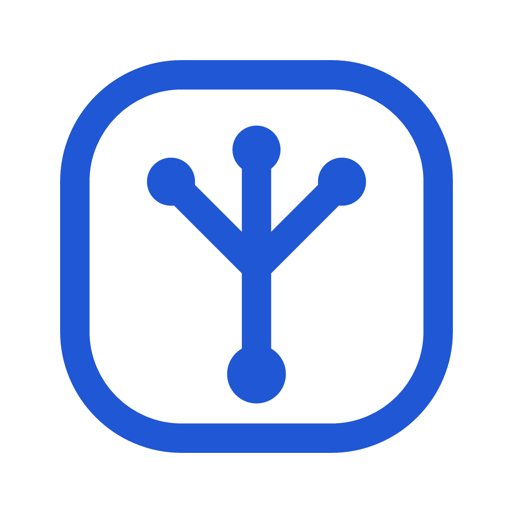

<p align="center">
  
</p>

# TreeUI

Clean components for modern products.

TreeUI is an open source component library built on a framework-agnostic foundation. The Vue 3 package ships a comprehensive, production-oriented component set with strong accessibility defaults and token-driven theming that outlives any single framework package, while an early React package brings the same tokens and primitives to React apps.

All public components use the `T` prefix, such as `TButton`, `TInput`, `TDatePicker`, and `TModal`.

## Why TreeUI

- Clean visual language with production-oriented defaults
- Accessibility-first interactions and predictable state contracts
- Semantic tokens and themes that stay framework-agnostic
- A compact API surface that is easier to maintain and extend
- A Docker workflow for teams without a local Node setup

## Getting Started

```bash
pnpm install
pnpm dev
```

Open [http://localhost:6006](http://localhost:6006) for the Vue Storybook.

Other local surfaces:

```bash
pnpm --filter @treeui/docs-react docs:dev   # React Storybook on :6007
pnpm --filter @treeui/landing dev           # landing page
pnpm example:vue:dev                        # Vue dashboard example on :6008
pnpm example:react:dev                      # React dashboard example on :6009
pnpm site:serve                             # assembled site on :6010
```

Without a local Node setup, prefix any command with `docker compose run --rm workspace`
(end-to-end tests: `docker compose run --rm e2e`), and `docker compose up docs` serves the
Vue Storybook on port 6006. Docker covers the Vue Storybook and the CI-equivalent checks;
the React Storybook, the landing page, and the example dashboards run through pnpm.

The quality gates to run before a pull request live in
[CONTRIBUTING.md](./CONTRIBUTING.md#before-opening-a-pull-request).

## Workspace Layout

```text
apps/landing                 Landing page that links to the per-framework docs
apps/docs                    Vue Storybook documentation and playground
apps/docs-react              React Storybook documentation and playground
examples/dashboard-vue       Runnable Vue dashboard example
examples/dashboard-react     Runnable React dashboard example
packages/tokens              Framework-agnostic design tokens and themes
packages/utils               Shared accessibility and interaction helpers
packages/icons               Curated icon registry and defaults
packages/vue                 Vue 3 component package and plugin entry
packages/react               React component package
packages/mcp                 TreeUI AI catalog and MCP server for coding agents
docs/ai                      Machine-oriented contracts for tools and agents
tooling                      Docker, ESLint, and TypeScript shared config
scripts                      Site assembly, static serving, and asset scripts
tests                        Playwright end-to-end specs
```

This is the one authoritative workspace map; other documents link here instead of
repeating it.

## Documentation Map

- `README.md`: project overview, quickstart, and repo map
- `ARCHITECTURE.md`: package boundaries and portability rules
- `DESIGN.md`: design principles and review checklist
- `CONTRIBUTING.md`: contributor workflow, quality gates, and release notes
- `RELEASING.md`: CI jobs, changesets, publishing, and GitHub Pages deployment
- `SECURITY.md`: supported versions and private vulnerability reporting
- `AGENTS.md`: repo-level guidance for coding agents
- `CLAUDE.md`: Claude Code-specific pointer to the same guidance
- `.github/copilot-instructions.md`: GitHub Copilot repository instructions
- `.mcp.json`: project-scoped TreeUI MCP server config for Claude Code
- `docs/ai/`: compact, canonical contracts for tools and automation
- `packages/mcp/`: generated catalog plus the `@treeui/mcp` server package

The human-facing product docs are the landing page in `apps/landing` plus one Storybook per
framework (`apps/docs` for Vue, `apps/docs-react` for React). Per-package release history lives
in `packages/*/CHANGELOG.md` and on [GitHub Releases](https://github.com/Viserion77/treeui/releases).

## AI Integrations

TreeUI now ships a repo-native AI context layer for coding agents and consumer projects:

- canonical machine-oriented contracts in `docs/ai/*.yaml`
- a generated normalized catalog at `docs/ai/treeui.catalog.json`
- a local MCP server in `packages/mcp`
- repo guidance in `AGENTS.md`, `CLAUDE.md`, and `.github/copilot-instructions.md`

Common commands:

```bash
pnpm ai:catalog
pnpm mcp:test
pnpm mcp:start
```

If you open this repository in Claude Code, `.mcp.json` points the project at the local `treeui` MCP server automatically after dependencies are installed.

## Contributing

Please read [CONTRIBUTING.md](./CONTRIBUTING.md) before opening a pull request.

## CI/CD & Release Flow

[Changesets](https://github.com/changesets/changesets) drives versioning and publishing, and a
single workflow (`.github/workflows/ci.yml`) validates, releases, and deploys.
[RELEASING.md](./RELEASING.md) describes that flow end to end — CI jobs, changesets, npm
publishing, repository settings, and troubleshooting.

### Documentation site

The site is deployed to GitHub Pages on every push to `main`. A landing
page links to one Storybook per framework:

- Home: [https://viserion77.github.io/treeui/](https://viserion77.github.io/treeui/)
- Vue: [https://viserion77.github.io/treeui/vue/](https://viserion77.github.io/treeui/vue/)
- React: [https://viserion77.github.io/treeui/react/](https://viserion77.github.io/treeui/react/)

## License

MIT. See [LICENSE](./LICENSE).
